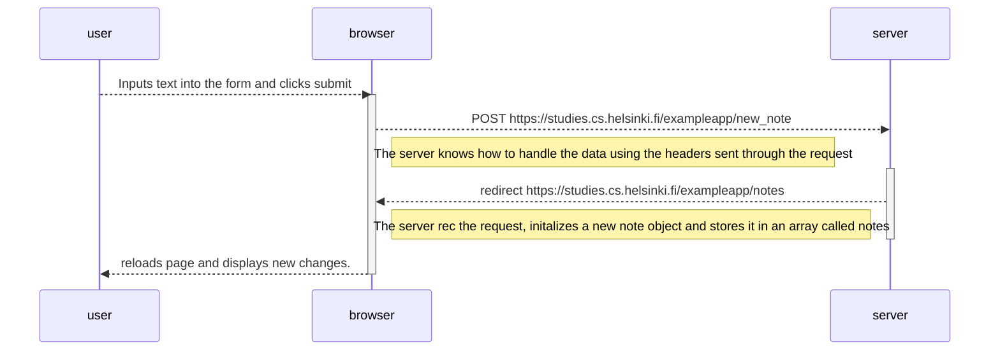

This is a sequence digram depicting the full interaction between a user, browser and server 
when a user submits to the form on the site https://studies.cs.helsinki.fi/exampleapp/new_note. 

```mermaid
sequenceDiagram
    participant user
    participant browser
    participant server

   user-->>browser: Inputs text into the form and clicks submit
   activate browser
   browser-->>server: POST https://studies.cs.helsinki.fi/exampleapp/new_note
   note right of browser: The server knows how to handle the data using the headers sent through the request
   activate server
   server-->>browser: redirect https://studies.cs.helsinki.fi/exampleapp/notes
   note right of browser: The server rec the request, initalizes a new note object and stores it in an array called notes
   deactivate server
   browser-->>user: reloads page and displays new changes.
   deactivate browser
```
