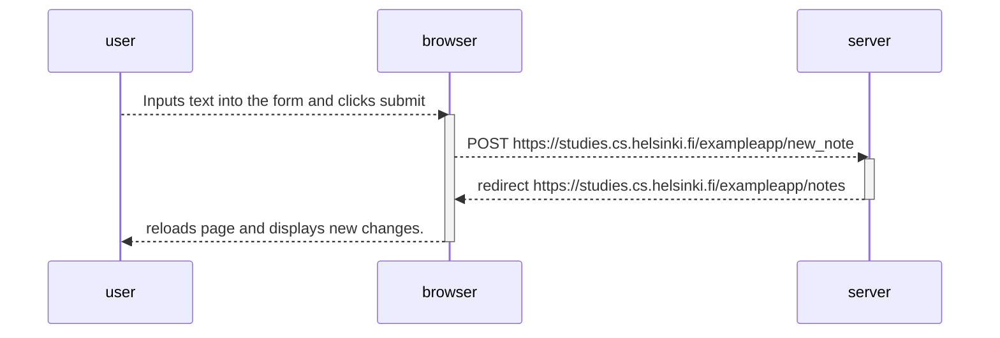

this is a test 

Here is a simple flow chart:

```mermaid
sequenceDiagram
    participant user
    participant browser
    participant server

   user-->>browser: Inputs text into the form and clicks submit
   activate browser
   browser-->>server: POST https://studies.cs.helsinki.fi/exampleapp/new_note
   activate server
   server-->>browser: redirect https://studies.cs.helsinki.fi/exampleapp/notes
   deactivate server
   browser-->>user: reloads page and displays new changes.
   deactivate browser
```
