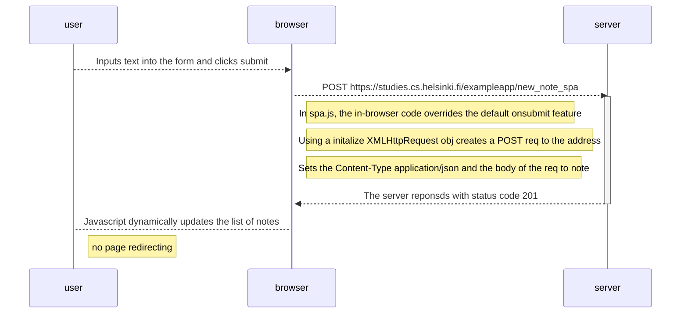

Below is a diagram depiciting what occurs when a user submits a form on the single-page 
app version of the notes app at https://studies.cs.helsinki.fi/exampleapp/spa 

```mermaid
sequenceDiagram
    participant user
    participant browser
    participant server

    user-->>browser: Inputs text into the form and clicks submit
    activate browser
    browser-->>server: POST https://studies.cs.helsinki.fi/exampleapp/new_note_spa
    activate server    
    note right of browser: In spa.js, the in-browser code overrides the default onsubmit feature
    note right of browser: Using a initalize XMLHttpRequest obj creates a POST req to the address
    note right of browser: Sets the Content-Type application/json and the body of the req to note
    server-->>browser: The server reponsds with status code 201
    deactivate server
    browser-->user: Javascript dynamically updates the list of notes
    note right of user: no page redirecting
```